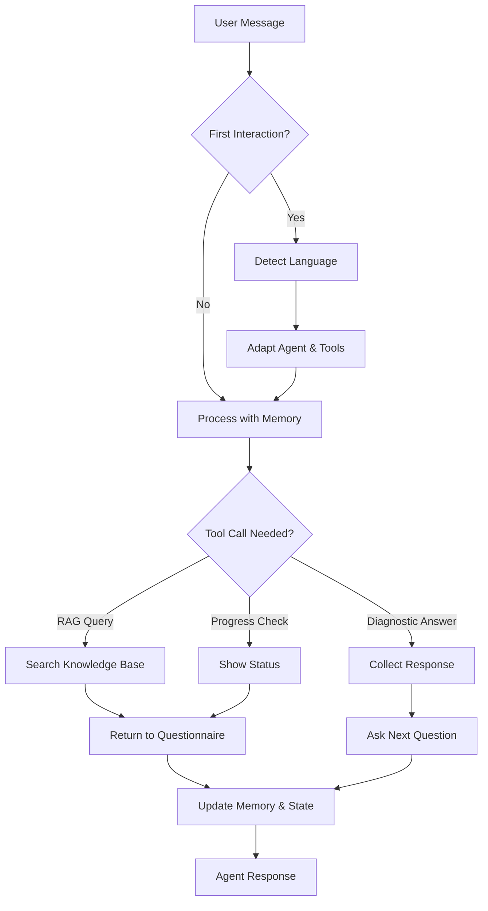

# 🤖 CCI Colombia Agent

**Bilingual conversational agent for CCI France-Colombia member needs assessment**

A sophisticated LangChain-powered agent that conducts personalized questionnaires while providing intelligent RAG-based responses about CCI services and information.

## ✨ Features

- **🎯 Structured Questionnaire**: 8 sequential questions for CCI member needs assessment
- **🧠 RAG Intelligence**: Answers questions using Pinecone vector database + OpenAI
- **🌍 Bilingual Support**: Automatic French/Spanish language detection and adaptation
- **💬 Conversational Memory**: Maintains context across multi-turn conversations
- **📱 WhatsApp Ready**: Stateless architecture for WhatsApp deployment
- **🎨 Interactive Testing**: Streamlit interface for easy testing and validation

## 🏗️ Architecture

- **Agent Framework**: LangChain with OpenAI Tools Agent
- **LLM**: OpenAI GPT-4o (conversation) + GPT-4o-mini (RAG reformulation)
- **Memory**: ConversationSummaryBufferMemory for efficient context management
- **Vector Database**: Pinecone with text-embedding-3-small
- **State Management**: Serializable agent state for stateless deployment
- **Tools**: Modular tool system (RAG search, diagnostic collection, progress tracking)

## 🚀 Quick Start

### 1. Clone and Install

```bash
git clone <repository>
cd CCI_colombia_agent
pip install -r requirements.txt
```

### 2. Environment Setup

Create a `.env` file with:

```bash
# OpenAI Configuration
OPENAI_API_KEY=sk-...

# Pinecone Configuration  
PINECONE_API_KEY=...
PINECONE_INDEX=...
PINECONE_ENV=...  # Optional
```

### 3. Test the Agent

**Interactive CLI Test:**
```bash
python scripts/test_langchain_agent.py
```

**Streamlit Web Interface:**
```bash
streamlit run streamlit_app.py
```

## 💻 Usage Examples

### Basic Conversation

```python
from app.agents.langchain_agent import CCILangChainAgent

# Create agent
agent = CCILangChainAgent()

# Start conversation (language auto-detected)
response = await agent.chat("Bonjour, je suis prêt")
print(response)  # Agent starts diagnostic questionnaire

# Continue conversation
response = await agent.chat("Oui, j'ai accédé à l'espace membre")
print(response)  # Agent collects answer and asks next question
```

### WhatsApp Integration

```python
from app.agents.whatsapp_handler import whatsapp_chat

# Stateless conversation for WhatsApp
response = await whatsapp_chat(
    user_id="whatsapp:+1234567890",
    user_input="Hola, estoy listo"
)
print(response)  # Agent responds in Spanish
```

### Agent State Management

```python
# Serialize agent state
agent = CCILangChainAgent()
state = agent.serialize_state()

# Later, restore agent from state
restored_agent = CCILangChainAgent.from_state(state)
```

## 🧪 Testing

### Interactive Tests

```bash
# Full agent test with menu
python scripts/test_langchain_agent.py

# Options:
# 1. Interactive Agent Test
# 2. Language Detection Test  
# 3. Memory Persistence Test
```

### Streamlit Interface

```bash
streamlit run streamlit_app.py
```

Features:
- Real-time conversation testing
- Agent status monitoring  
- Conversation reset functionality
- User ID management

## 📁 Project Structure

```
CCI_colombia_agent/
├── app/
│   └── agents/                    # Core agent system
│       ├── langchain_agent.py     # Main LangChain agent class
│       ├── tools.py               # Agent tools (RAG, diagnostic)
│       ├── rag.py                 # RAG implementation (Pinecone + OpenAI)
│       ├── language.py            # Language detection utilities
│       ├── prompts_utils.py       # Prompt loading utilities
│       ├── whatsapp_handler.py    # Stateless WhatsApp wrapper
│       └── prompts/               # System prompts
│           ├── diagnostic_prompt.txt      # French prompts
│           └── diagnostic_prompt_es.txt   # Spanish prompts
├── scripts/
│   └── test_langchain_agent.py    # Interactive testing script
├── streamlit_app.py               # Web testing interface
├── requirements.txt               # Python dependencies
├── .env                          # Environment variables (create this)
└── .gitignore                    # Git ignore rules
```

## 🛠️ Core Components

### LangChain Agent (`langchain_agent.py`)
- **Memory Management**: ConversationSummaryBufferMemory for context
- **Language Detection**: Automatic French/Spanish detection and adaptation
- **State Serialization**: Full agent state persistence for stateless deployment
- **Tool Integration**: Dynamic tool loading and management

### Tools System (`tools.py`)
- **RAG Search Tool**: Query CCI knowledge base
- **Diagnostic Collection**: Collect and validate questionnaire responses
- **Progress Tracking**: Monitor diagnostic completion status
- **Bilingual Support**: Language-aware tool responses

### RAG Implementation (`rag.py`)
- **Vector Search**: Pinecone integration with embedding generation
- **Response Reformulation**: OpenAI-powered answer improvement
- **Multilingual**: Language-specific system prompts
- **Error Handling**: Graceful fallbacks for missing information

### WhatsApp Handler (`whatsapp_handler.py`)
- **Stateless Design**: Load/save user state per message
- **User Management**: Individual conversation state tracking
- **Reset Functionality**: Conversation restart capabilities
- **Webhook Integration**: WhatsApp Business API support

## 🌍 Multilingual Support

The agent automatically detects user language and adapts:

- **French Detection**: Loads `diagnostic_prompt.txt`
- **Spanish Detection**: Loads `diagnostic_prompt_es.txt`  
- **Tool Synchronization**: All tools adapt to detected language
- **Response Formatting**: Language-appropriate error messages and responses

## 📊 Agent Workflow



## 🔧 Configuration

### Environment Variables

| Variable | Description | Required |
|----------|-------------|----------|
| `OPENAI_API_KEY` | OpenAI API key | ✅ |
| `PINECONE_API_KEY` | Pinecone API key | ✅ |
| `PINECONE_INDEX` | Pinecone index name | ✅ |
| `PINECONE_ENV` | Pinecone environment | ❌ |

### Agent Parameters

```python
# Customize agent behavior
agent = CCILangChainAgent(
    prompt_name="diagnostic_prompt"  # Custom prompt file
)

# Force specific language (useful for testing)
agent.set_language("es")  # Force Spanish

# Get agent status
status = agent.get_status()
print(f"Question: {status['current_question']}/8")
print(f"Answers: {status['answers_collected']}")
```

## 🚀 Production Deployment

### WhatsApp Integration

```python
# Webhook endpoint example
@app.post("/whatsapp/webhook")
async def whatsapp_webhook(webhook_data: dict):
    # Extract user data
    data = extract_whatsapp_data(webhook_data)
    if not data:
        return {"error": "Invalid webhook data"}
    
    # Process message
    response = await whatsapp_chat(
        user_id=data["user_id"],
        user_input=data["message"]
    )
    
    # Send response back to WhatsApp
    return {"response": response}
```

### State Persistence

For production, replace in-memory storage in `whatsapp_handler.py`:

```python
# Replace _user_states dictionary with Redis/Database
import redis

redis_client = redis.Redis(host='localhost', port=6379, db=0)

async def save_user_state(user_id: str, state: dict):
    await redis_client.set(
        f"user_state:{user_id}", 
        json.dumps(state), 
        ex=86400  # 24h TTL
    )
```

## 🔒 Security & Best Practices

- ✅ Environment variables for sensitive data
- ✅ Input validation and error handling
- ✅ Graceful fallbacks for service failures
- ✅ Memory management for long conversations
- ✅ Rate limiting ready (implement in production)
- ✅ Audit logging capabilities

## 📈 Performance

- **Memory Efficiency**: Automatic conversation summarization
- **Cost Optimization**: GPT-4o-mini for RAG reformulation
- **Lazy Loading**: Services initialized on demand
- **Stateless Design**: Horizontal scaling ready
- **Vector Search**: Optimized Pinecone queries with metadata filtering

## 🤝 Contributing

1. Follow the modular architecture
2. Add tests for new features
3. Update prompts for both languages
4. Maintain English comments, French user-facing content
5. Test with both CLI and Streamlit interfaces

## 📄 License

[Add your license information here]

---

**Built with ❤️ for CCI France-Colombia** 